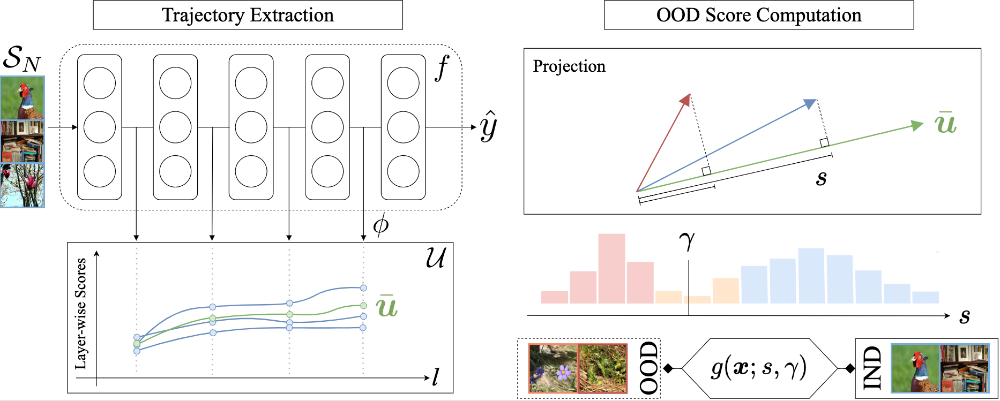
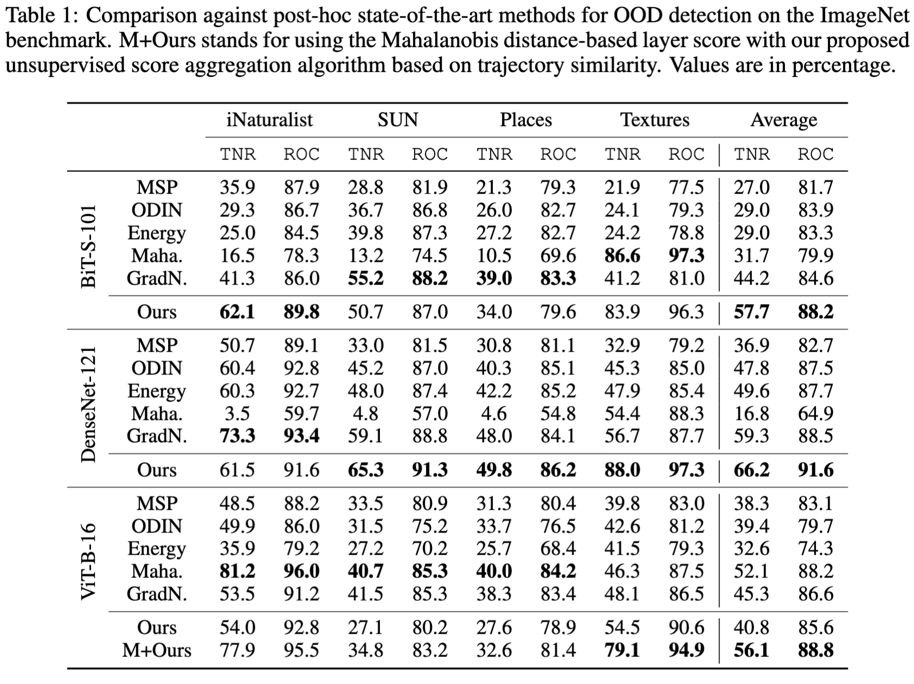

<h1 align="center">
A Functional Perspective on Multi-Layer Out-of-Distribution Detection
</h1>



Fig 1. The left-hand side shows the mapping of the hidden representations of an input sample into a functional representation. Then, during test time, we compute the OOD score $s$ of a sample. A threshold $\gamma$ is set to obtain a binary discriminator $g$.

Submitted to ICLR 2023.

## Requirements

To reproduce the results, you will need to install the following packages:

- Python 3.7+
- torch >= 1.10.0
- torchvision

Plus additional requirements. Please run `pip install -r requirements.txt` to install them.

## Usage

1. Download resources

```shell
python download.py
```

2. Save features

```shell
source .env
in_dataset_name="ILSVRC2012"
models=(
    "DENSENET121"\
    "BITSR101"\
    "VIT16B"\
)
out_dataset_names=(
    "TEXTURES"\
    "MOS_INATURALIST"\
    "MOS_SUN"\
    "MOS_PLACES"\
)
for model in ${models[*]}
do
    model_name=${model}_${in_dataset_name}
    python3 save_features.py \
        --model $model_name  \
        --dataset $in_dataset_name

    python3 save_features.py \
        --model $model_name  \
        --dataset $in_dataset_name --train
    
    for out_dataset_name in ${out_dataset_names[*]}
    do
        python3 save_features.py \
            --model $model_name \
            --dataset $out_dataset_name
    done
done
```

3. Save functional dataset

```shell
source .env
python3 save_functional_dataset.py  --detector projection \
    -outs TEXTURES MOS_PLACES MOS_SUN MOS_INATURALIST \
    --batch-size 50000 --model densenet121_ilsvrc2012

python3 save_functional_dataset.py  --detector projection \
    -outs TEXTURES MOS_PLACES MOS_SUN MOS_INATURALIST \
    --batch-size 50000 --model bitsr101_ilsvrc2012

python3 save_functional_dataset.py  --detector projection \
    -outs TEXTURES MOS_PLACES MOS_SUN MOS_INATURALIST \
    --batch-size 50000 --model vit16b_ilsvrc2012
```

4. Calculate score from tajectories

```shell
source .env
python3 trajectory_score.py --detector projection \
    -outs TEXTURES MOS_PLACES MOS_SUN MOS_INATURALIST \
    --model densenet121_ilsvrc2012 \
    -agg innerproduct

python3 trajectory_score.py --detector projection \
    -outs TEXTURES MOS_PLACES MOS_SUN MOS_INATURALIST \
    --model bitsr101_ilsvrc2012 \
    -agg innerproduct

python3 trajectory_score.py --detector projection \
    -outs TEXTURES MOS_PLACES MOS_SUN MOS_INATURALIST \
    --model vit16b_ilsvrc2012 \
    -agg innerproduct
```

## Our Method

In a simplified way, our method consists of the following steps:

1. OOD layer-wise score

```python
def cosine_layer_score(x: Tensor, mus: Tensor):
    stack = torch.zeros(x.shape[0], len(mus), device=x.device, dtype=x.dtype)
    for i, mu in enumerate(mus):
        stack[:, i] = F.cosine_similarity(x, mu.unsqueeze(0), dim=-1)
    return stack


class LayerWiseProjectionScore:
    def __init__(self):
        self.mus = None

    def fit(self, X: Tensor, labels: Tensor):
        self.mus = []
        unique_classes = torch.unique(labels).detach().cpu().numpy().tolist()
        for c in unique_classes:
            filt = labels == c
            if filt.sum() == 0:
                continue
            self.mus.append(X[filt].mean(0, keepdim=True))
        self.mus = torch.vstack(self.mus)

    def __call__(self, x: Tensor, pred: Tensor):
        pred = pred.reshape(-1,1)
        mask = (
            torch.vstack([torch.arange(n_classes, device=pred.device)] * len(scores))
            == pred
        )
        scores  = (
            torch.norm(x, p=2, dim=-1, keepdim=True) * 
            cosine_layer_score(x, self.mus.to(x.device)
        )

        pred_scores = scores[mask]
        return pred_scores.reshape(-1, 1)
       

```

2. Score aggregation

```python
class InnerProductAggregation:
    def __init__(self) -> None:
        self.mean = None
        self.max_ = None

    def fit(self, X: np.ndarray):
        self.max_ = np.max(X, axis=0)
        X = X / self.max_
        self.mean = np.mean(X, axis=0, keepdims=True)

    def __call__(self, x: np.ndarray):
        x = x / self.max_
        return np.inner(x, self.mean).reshape(-1) / np.sum(self.mean**2)
```

## Results



### (Optional) Environmental Variables

Please, place the following lines in your `.env` file if you want tyo modify any of the default folders.

```bash
#.env
export DATASETS_DIR="data"
export IMAGENET_ROOT="data/ILSVRC2012/"
export PRE_TRAINED_DIR="${PWD}/vision/pre_trained"
export TENSORS_DIR="tensors"
export RESULTS_DIR="results"
```

Where:

- `DATASETS_DIR` is the directory where the datasets will be downloaded.
- `IMAGENET_ROOT` is the directory where the ImageNet dataset is located.
- `PRE_TRAINED_DIR` is the directory where the pre-trained models will be downloaded.
- `TENSORS_DIR` is the directory where the features tensors will be saved.
- `RESULTS_DIR` is the directory where the results will be saved.