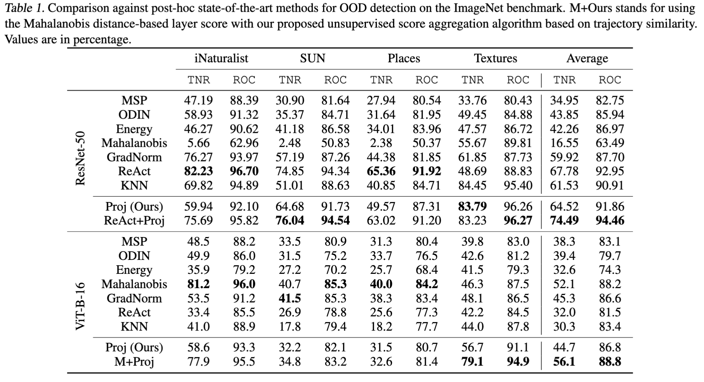

<h1 align="center">
A Functional Perspective on Multi-Layer Out-of-Distribution Detection
</h1>


Fig 1. The left-hand side shows the mapping of the hidden representations of an input sample into a functional representation. Then, during test time, we compute the OOD score $s$ of a sample. A threshold $\gamma$ is set to obtain a binary discriminator $g$.


**Submitted to ICML 2023.**

## Requirements

To reproduce the results, you will need to install the following packages:

- Python 3.7+
- torch >= 1.11.0
- torchvision

And additional requirements. Please run `pip install -r requirements.txt` to install them.

## Usage

1. Download resources

```shell
source .env
python download.py
```

2. Save features

```shell
source .env
in_dataset_name="ILSVRC2012"
models=(
    "DENSENET121"\
    "BITSR101"\
    "VIT16B"\
    "RESNET50"\
)
out_dataset_names=(
    "TEXTURES"\
    "MOS_INATURALIST"\
    "MOS_SUN"\
    "MOS_PLACES"\
)
for model in ${models[*]}
do
    model_name=${model}_${in_dataset_name}
    python3 save_features.py \
        --model $model_name  \
        --dataset $in_dataset_name

    python3 save_features.py \
        --model $model_name  \
        --dataset $in_dataset_name --train
    
    for out_dataset_name in ${out_dataset_names[*]}
    do
        python3 save_features.py \
            --model $model_name \
            --dataset $out_dataset_name
    done
done
```

3. Save functional dataset

```shell
source .env
python3 save_functional_dataset.py  --detector projection \
    -outs TEXTURES MOS_PLACES MOS_SUN MOS_INATURALIST \
    --batch-size 50000 --model densenet121_ilsvrc2012

python3 save_functional_dataset.py  --detector projection \
    -outs TEXTURES MOS_PLACES MOS_SUN MOS_INATURALIST \
    --batch-size 50000 --model bitsr101_ilsvrc2012

python3 save_functional_dataset.py  --detector projection \
    -outs TEXTURES MOS_PLACES MOS_SUN MOS_INATURALIST \
    --batch-size 50000 --model vit16b_ilsvrc2012

python3 save_functional_dataset.py  --detector projection \
    -outs TEXTURES MOS_PLACES MOS_SUN MOS_INATURALIST \
    --batch-size 50000 --model resnet50_ilsvrc2012
```

4. Calculate scores from trajectories

```shell
source .env
python3 trajectory_score.py --detector projection \
    -outs TEXTURES MOS_PLACES MOS_SUN MOS_INATURALIST \
    --model densenet121_ilsvrc2012 \
    -agg innerproduct

python3 trajectory_score.py --detector projection \
    -outs TEXTURES MOS_PLACES MOS_SUN MOS_INATURALIST \
    --model bitsr101_ilsvrc2012 \
    -agg innerproduct

python3 trajectory_score.py --detector projection \
    -outs TEXTURES MOS_PLACES MOS_SUN MOS_INATURALIST \
    --model vit16b_ilsvrc2012 \
    -agg innerproduct

python3 trajectory_score.py --detector projection \
    -outs TEXTURES MOS_PLACES MOS_SUN MOS_INATURALIST \
    --model resnet50_ilsvrc2012 \
    -agg innerproduct
```

- Reproducing the baseline results example

```shell
python3 baselines.py --detector odin \
    --batch-size 64 --temperature 1000 --eps 0  \
    --model densenet121_ilsvrc2012 --dataset textures
 ```

The arguments for the `detector` are `ODIN`, `ENERGY`, and `GRADNORM`.

## Our Method

In a simplified way, our method consists of the following steps:

1. OOD layer-wise score

```python
import torch
from torch import Tensor


def projection_layer_score(x: Tensor, mus: Tensor, eps=1e-7):
    # efficient cosine similarity
    num = x @ mus.T
    den = torch.norm(x, dim=-1, keepdim=True) @ torch.norm(mus, dim=-1, keepdim=True).T
    stack = num / (den + eps)
    # multiply by norm
    return torch.norm(x, p=2, dim=-1, keepdim=True) * stack


class LayerWiseProjectionScore:
    def __init__(self):
        self.mus = None

    def fit(self, X: Tensor, labels: Tensor):
        self.mus = []
        unique_classes = torch.unique(labels).detach().cpu().numpy().tolist()
        for c in unique_classes:
            filt = labels == c
            if filt.sum() == 0:
                continue
            self.mus.append(X[filt].mean(0, keepdim=True))
        self.mus = torch.vstack(self.mus)

    def __call__(self, x: Tensor, probs: Tensor):
        scores = torch.norm(x, p=2, dim=-1, keepdim=True) * projection_layer_score(x, self.mus.to(x.device))
        return torch.sum(probs * scores, dim=-1, keepdim=True)
```

2. Score aggregation

```python
import numpy as np


class InnerProductAggregation:
    def __init__(self) -> None:
        self.mean = None
        self.max_ = None

    def fit(self, training_trajectories: np.ndarray):
        self.max_ = np.max(training_trajectories, axis=0)
        training_trajectories = training_trajectories / self.max_
        self.mean = np.mean(training_trajectories, axis=0, keepdims=True)

    def __call__(self, test_trajectory: np.ndarray):
        test_trajectory = test_trajectory / self.max_
        return np.inner(test_trajectory, self.mean).reshape(-1) / np.sum(self.mean**2)
```

## Results



### (Optional) Environmental Variables

Please, place the following lines in your `.env` file if you want to modify any of the default folders.

```bash
#.env
export DATASETS_DIR="data"
export IMAGENET_ROOT="data/ILSVRC2012/"
export PRE_TRAINED_DIR="${PWD}/vision/pre_trained"
export TENSORS_DIR="tensors"
export RESULTS_DIR="results"
```

Where:

- `DATASETS_DIR` is the directory where the datasets will be downloaded.
- `IMAGENET_ROOT` is the directory where the ImageNet dataset is located.
- `PRE_TRAINED_DIR` is the directory where the pre-trained models will be downloaded.
- `TENSORS_DIR` is the directory where the features tensors will be saved.
- `RESULTS_DIR` is the directory where the results will be saved.
